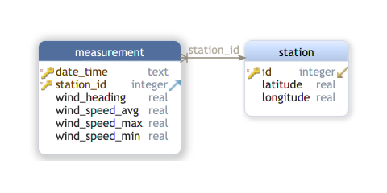

# Projet "foil"

## Contexte du projet
Après avoir vu les images de l’America’s cup dans la baie d’Auckland, Cléante de Nantes a décidé de se mettre au catamaran avec foil.

Avant d’investir dans son engin high tech, elle a décidé de faire une petite application pour sa montre connectée qui donne en temps réel les dernières mesures sur 3 stations locales disposant d’un anémomètre. Elle souhaite savoir où se diriger pour trouver le vent nécessaire à ses futures activités.

Malheureusement sa montre dispose d’un stockage particulièrement réduit, donc la base de données locale devra être mise à jour régulièrement tout en s’assurant de ne pas dépasser un volume de stockage correspondant aux 4 derniers enregistrements par station. Enfin, un tantinet paranoïaque, elle souhaite absolument avoir la dernière sauvegarde qui devra être mise à jour régulièrement (une fois tous les 2 enregistrements).

Pourrez-vous aider Cléante à réaliser son projet en moins de 48h chrono?

Contrainte: usage de SQLite sur la montre

Les données pourront être récupérées auprès d’anémomètres connectés: [les “pioupiou”s](https://www.openwindmap.org/PP113)

Ceux-ci disposent d’une [API qui peut être interrogée](http://developers.pioupiou.fr/api/live/)

## Exécuter l'application
`python app.py`

## Tests des modules utilisés
Accès par requête html à un anémomètre "pioupiou":  
`python data.py`

Création et manipulation de la base de données SQLite:  
`python database.py`

## Base de données: SQLite
 
BDD:  
`wind.db`

 
### Documentation
[SQLite](https://sqlite.org/docs.html)  
[python SQLite](https://docs.python.org/3/library/sqlite3.html)
 
Datatypes In SQLite: [https://sqlite.org/datatype3.html](https://sqlite.org/datatype3.html)
 
### Clients
Client graphique pour SQLite: [sqlitebrowser](https://sqlitebrowser.org/)

Client en ligne de commande pour SQLite: `sqlite3`, `sqlite3 db_name`  
sortie du client `.quit`

### Reverse engineering
Création du schéma à partir de la base SQLite: [dbschema.com](https://dbschema.com/)
 
 
 
## Evolutions
- Finaliser les documentations de fonctions en y ajoutant les signatures
- Utilisation de threads dans le programme principal pour pouvoir sortir proprement de la boucle infinie  
- Utilisation de `try ... except ...` lors des accès à la base pour gérer les problèmes éventuels
- Délocaliser les paramètres et les entrées dans un ou plusieurs fichiers dédiés